# How to use AWS Lamda

Serverless solution

## How to deploy Java Spring Boot app to AWS with Lambda and how to leverage AWS Lambda SnapStart

AWS Lambda SnapStart is a new performance optimization developed by AWS that can significantly improve the startup time for applications. This feature delivers up to 10x faster function startup times for latency-sensitive Java applications at no extra cost, and with minimal or no code changes.

### Java part


`import java.util.function.Function;`

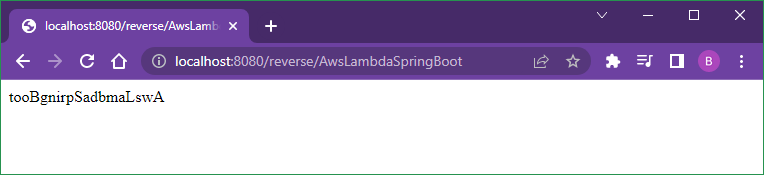

```xml
  <dependency>
   <groupId>org.springframework.cloud</groupId>
   <artifactId>spring-cloud-function-adapter-aws</artifactId>
  </dependency>
```

```xml
 <build>
  <plugins>
   <plugin>
    <groupId>org.apache.maven.plugins</groupId>
    <artifactId>maven-deploy-plugin</artifactId>
    <configuration>
     <skip>true</skip>
    </configuration>
   </plugin>
   <plugin>
    <groupId>org.springframework.boot</groupId>
    <artifactId>spring-boot-maven-plugin</artifactId>
    <dependencies>
     <dependency>
      <groupId>org.springframework.boot.experimental</groupId>
      <artifactId>spring-boot-thin-layout</artifactId>
      <version>1.0.28.RELEASE</version>
     </dependency>
    </dependencies>
   </plugin>
   <plugin>
    <groupId>org.apache.maven.plugins</groupId>
    <artifactId>maven-shade-plugin</artifactId>
    <version>3.2.4</version>
    <configuration>
     <createDependencyReducedPom>false</createDependencyReducedPom>
     <shadedArtifactAttached>true</shadedArtifactAttached>
     <shadedClassifierName>aws</shadedClassifierName>
    </configuration>
   </plugin>
  </plugins>
 </build>
```

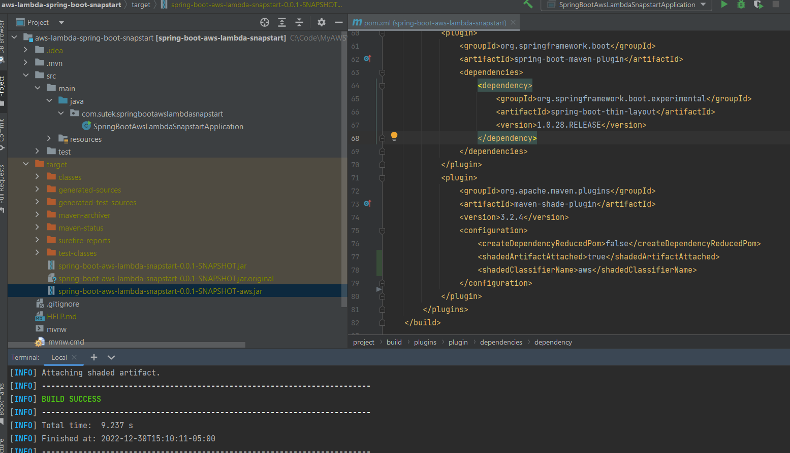

### AWS part

Update `???-aws.jar` to AWS Lambda function

1st test (cold start)

```dos
Init duration: 4788.92 ms
Duration: 338.85 ms
Billed durartion: 359 ms
```


2nd test (hot start)


```dos
Duration: 2.29 ms
Billed durartion: 3 ms
```

Note both the "Duration" and "Billed duration" are much smaller in the 2nd test.

### Add the "SnapStart"

```dos
Configuration -> Edit -> SnapStart -> PublishedVersions -> Save
=>
Versions -> Publish a new version
```

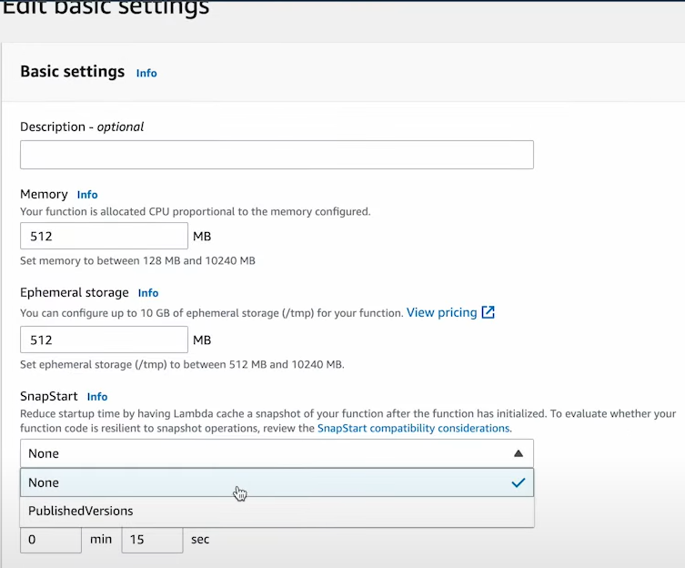


3rd test (SnapStart's cold start)

```dos
Restore duration: 351.72 ms
Duration: 370.38 ms
Billed duration: 589 ms
```

The "Restore duration" is 351.72 ms - much smaller than 4788.92 ms

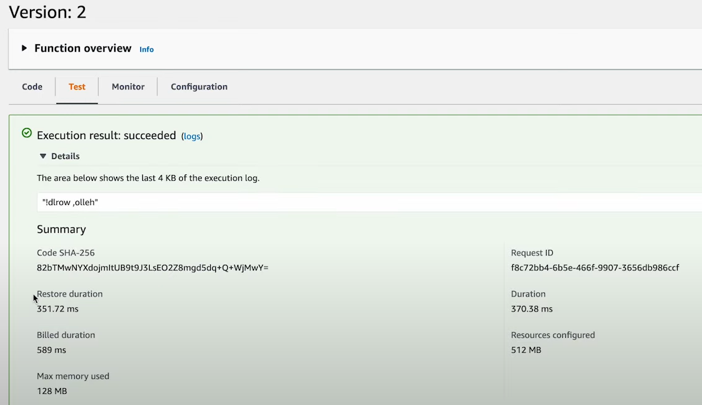

4th test (SnapStart's hot start)

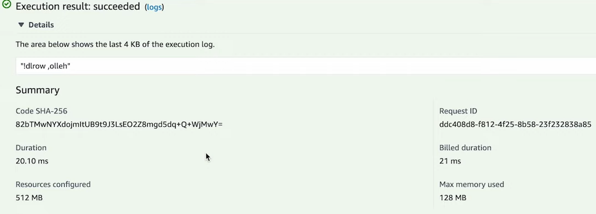

```dos
Duration: 20.10 ms
Billed durartion: 21 ms
```

## How to deploy Java app to AWS with Lambda

### Hello World

[Java part]

Amazon Corretto

org.apache.maven.archetypes:maven-archetype-quickstart


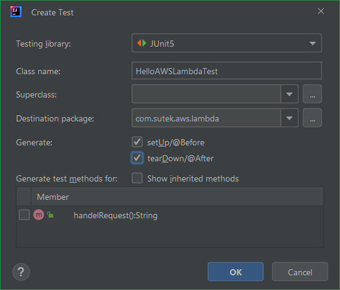

```xml
  <properties>
    <project.build.sourceEncoding>UTF-8</project.build.sourceEncoding>
    <maven.compiler.source>11</maven.compiler.source>
    <maven.compiler.target>11</maven.compiler.target>
  </properties>

  <dependencies>
    <dependency>
      <groupId>org.junit.jupiter</groupId>
      <artifactId>junit-jupiter</artifactId>
      <version>5.8.2</version>
      <scope>test</scope>
    </dependency>
  </dependencies>

  <build>
    <plugins>
      <plugin>
        <groupId>org.apache.maven.plugins</groupId>
        <artifactId>maven-shade-plugin</artifactId>
        <version>3.2.4</version>
        <configuration>
          <createDependencyReducedPom>false</createDependencyReducedPom>
        </configuration>
        <executions>
          <execution>
            <phase>package</phase>
            <goals>
              <goal>shade</goal>
            </goals>
          </execution>
        </executions>
      </plugin>
    </plugins>
  </build>
```

```java
public class HelloAWSLambda
{
    public String handelRequest()
    {
        return "Hello AWS Lambda";
    }
}
```

```dos
mvn clean package
```

`hello-lambda-1.0-SNAPSHOT.jar`


[IntelliJ tips]

If you got issues like "Unresolved plugin: 'org.apache.maven.plugins:maven-clean-plugin:2.5'", try to clean up .m2 folder.

- Close IntelliJ
- mv .m2 .m2_old
- Lanuch IntelliJ again
- CTRL+SHIFT+A -> "Reload All Maven Projects"

Also, if rebuild doesn't resolve some maven issues, try "Reload All Maven Projects"!

[AWS part]

Create function


Upload .jar file


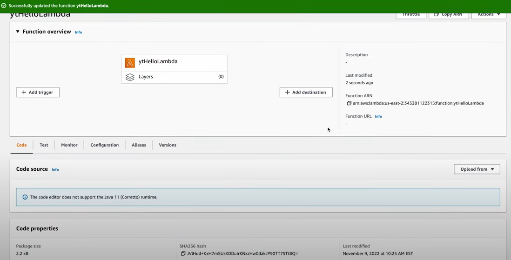

Edit runtime settings


Test

In this case, just empty string


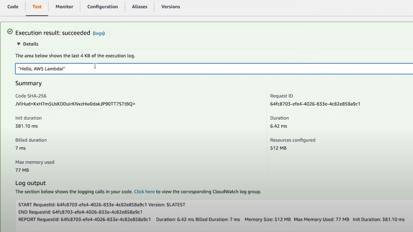

### Hello name

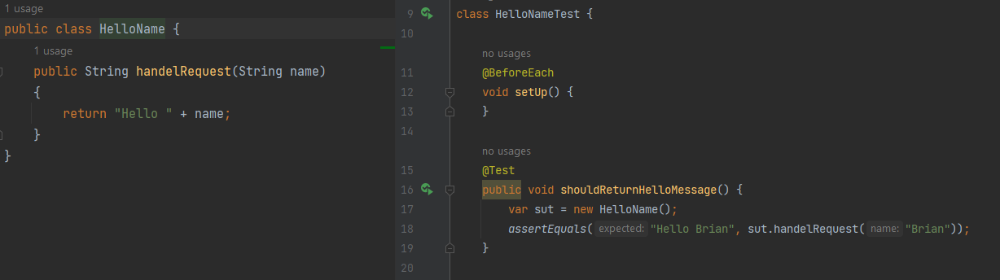

Test

In this case, just simple string

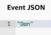

## How to use the AWS Lambda Java Core Library

[Developer Guide]

<https://docs.aws.amazon.com/lambda/latest/dg/lambda-java.html>

Lambda provides the following libraries for Java functions:

- com.amazonaws:aws-lambda-java-core (required) – Defines handler method interfaces and the context object that the runtime passes to the handler. If you define your own input types, this is the only library that you need.
- com.amazonaws:aws-lambda-java-events – Input types for events from services that invoke Lambda functions.
- com.amazonaws:aws-lambda-java-log4j2 – An appender library for Apache Log4j 2 that you can use to add the request ID for the current invocation to your function logs.
- AWS SDK for Java 2.0 – The official AWS SDK for the Java programming language.

[Java part]

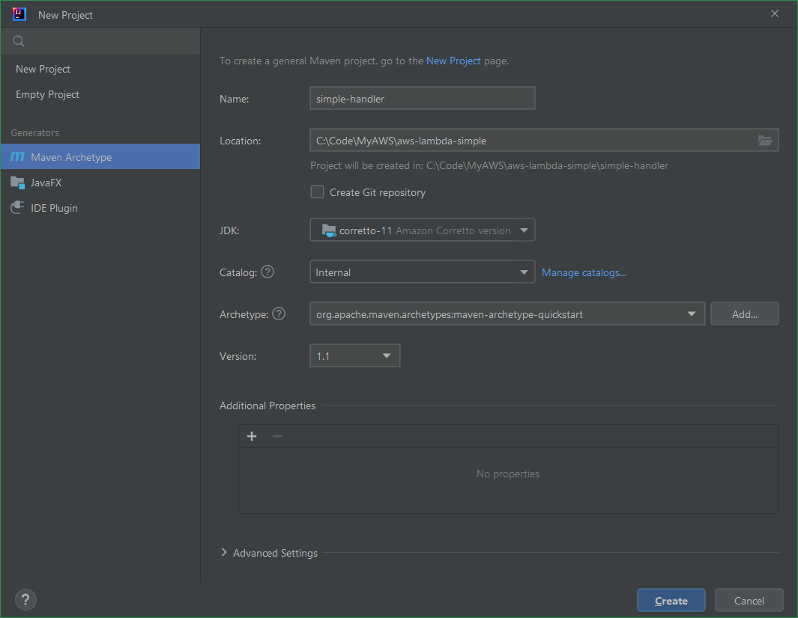

```xml
  <properties>
    <project.build.sourceEncoding>UTF-8</project.build.sourceEncoding>
    <maven.compiler.source>11</maven.compiler.source>
    <maven.compiler.target>11</maven.compiler.target>
  </properties>

  <dependencies>
    <dependency>
      <groupId>com.amazonaws</groupId>
      <artifactId>aws-lambda-java-core</artifactId>
      <version>1.2.1</version>
    </dependency>
    <dependency>
      <groupId>org.junit.jupiter</groupId>
      <artifactId>junit-jupiter</artifactId>
      <version>5.8.2</version>
      <scope>test</scope>
    </dependency>
  </dependencies>
```


[AWS part]

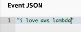


