# MyAWS

My AWS

## My AWS projects

### Project 3

Created a progressive web application and deployed to AWS for a federal client

- Built a new web application with React, TypeScript, Material UI, Router, i18n, axios, formik, lodash and S3 on front end, Node.js, Redis, winston, dotenv, AWS Lambda functions, Amazon API Gateway, Aurora PostgreSQL on back end.
- Managed the database schema changes, version controls and automated deployment scripts with Liquibase.
- Used CI/CD pipelines for different projects with AWS CloudFormation, CloudBuild, CodeCommit, CodePipeline and Azure DevOps.

### Project 2

Modernized an on premise application built with C# .Net and MS SQL Server to AWS cloud with Amazon Relational Database Service for a bank client

- Installed and configured AWS Toolkit for Visual Studio.
- Switched on premise MS SQL Server to AWS RDS.
- Scaled performance with asynchronous messaging.
- Published ASP .NET Core application to AWS Elastic Beanstalk.
- Added Docker support to ASP .NET application.
- Packaged .NET application in Docker using MSIs.
- Deployed to Docker containers Fargate.
- Ensured containers’ Load Balancer can access RDS instance.

### Project 1

Migrated an on premise Cassandra to DynamoDB with AWS DMS for an insurance client

- Used AWS Schema Conversion Tool Clone Data Center wizard to add a new Cassandra data center and replicated data.
- Converted Cassandra tables to DynamoDB structures with SCT.
- Created SCT data extract tasks, programmed custom Data Extractors with Java.
- Configured the IAM role and attached permission policy.
- Installed and configured SCT data extracting agents.
- Dumped encrypted data with the agents.
- Converted .csv files to appropriate formats.
- Uploaded to AWS S3 bucket.
- Loaded to AWS DynamoDB with AWS Data Migration Service.

## Learn AWS

[Learn AWS](LearnAWS.md)

## My AWS solutions

### How to find the closest supported region

Use `CloudPing.co`

### How to use AWS Lamda

Serverless solution

#### How to deploy Java Spring Boot app to AWS with Lambda and how to leverage AWS Lambda SnapStart

AWS Lambda SnapStart is a new performance optimization developed by AWS that can significantly improve the startup time for applications. This feature delivers up to 10x faster function startup times for latency-sensitive Java applications at no extra cost, and with minimal or no code changes.

[Java part]

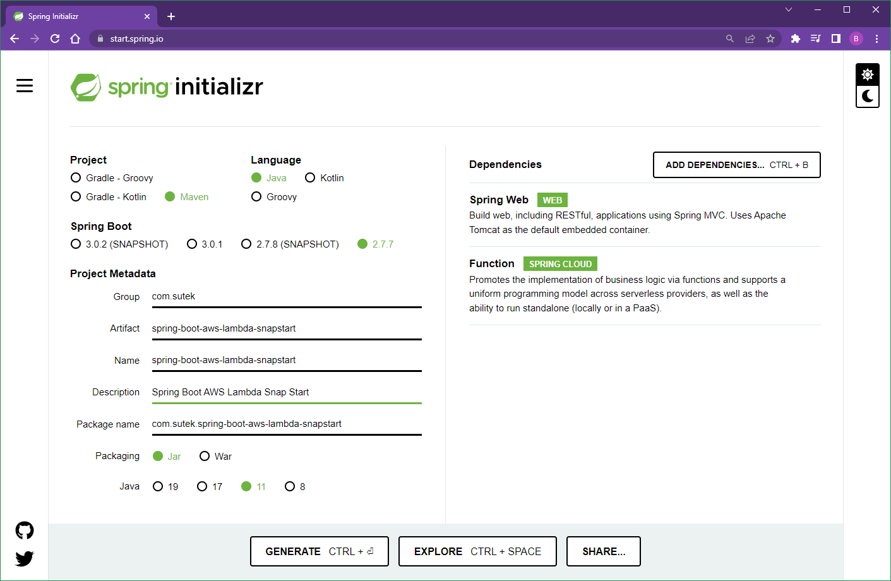

`import java.util.function.Function;`

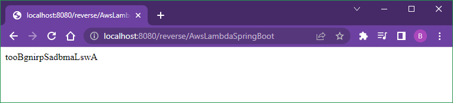

```xml
  <dependency>
   <groupId>org.springframework.cloud</groupId>
   <artifactId>spring-cloud-function-adapter-aws</artifactId>
  </dependency>
```

```xml
 <build>
  <plugins>
   <plugin>
    <groupId>org.apache.maven.plugins</groupId>
    <artifactId>maven-deploy-plugin</artifactId>
    <configuration>
     <skip>true</skip>
    </configuration>
   </plugin>
   <plugin>
    <groupId>org.springframework.boot</groupId>
    <artifactId>spring-boot-maven-plugin</artifactId>
    <dependencies>
     <dependency>
      <groupId>org.springframework.boot.experimental</groupId>
      <artifactId>spring-boot-thin-layout</artifactId>
      <version>1.0.28.RELEASE</version>
     </dependency>
    </dependencies>
   </plugin>
   <plugin>
    <groupId>org.apache.maven.plugins</groupId>
    <artifactId>maven-shade-plugin</artifactId>
    <version>3.2.4</version>
    <configuration>
     <createDependencyReducedPom>false</createDependencyReducedPom>
     <shadedArtifactAttached>true</shadedArtifactAttached>
     <shadedClassifierName>aws</shadedClassifierName>
    </configuration>
   </plugin>
  </plugins>
 </build>
```

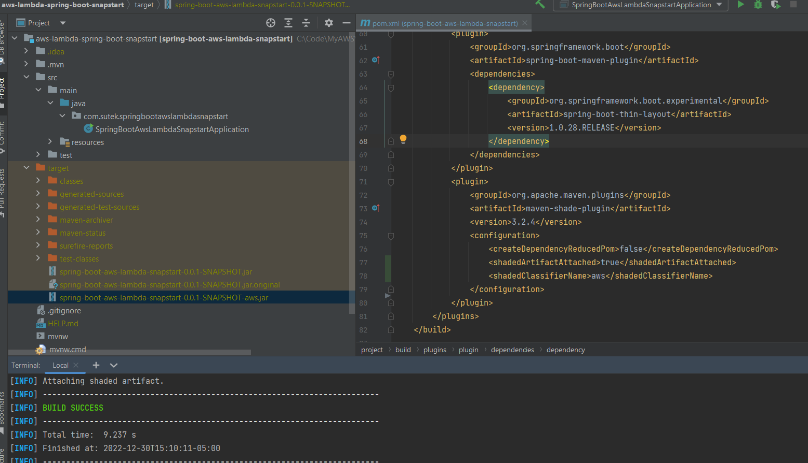

[AWS part]

Update `???-aws.jar` to AWS Lambda function

1st test (cold start)

```dos
Init duration: 4788.92 ms
Duration: 338.85 ms
Billed durartion: 359 ms
```

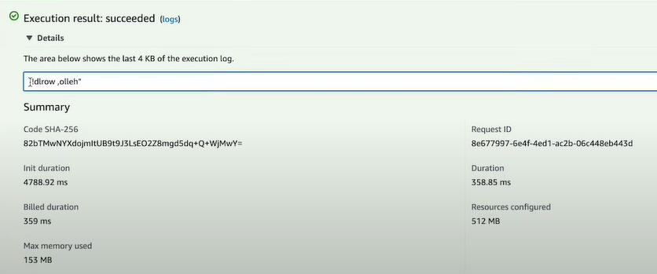

2nd test (hot start)

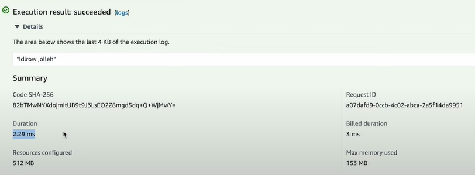

```dos
Duration: 2.29 ms
Billed durartion: 3 ms
```

Note both the "Duration" and "Billed duration" are much smaller in the 2nd test.

[Add the "SnapStart"]

```dos
Configuration -> Edit -> SnapStart -> PublishedVersions -> Save
=>
Versions -> Publish a new version
```

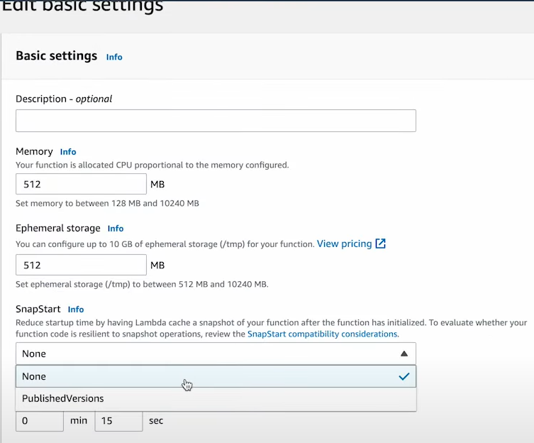


3rd test (SnapStart's cold start)

```dos
Restore duration: 351.72 ms
Duration: 370.38 ms
Billed duration: 589 ms
```

The "Restore duration" is 351.72 ms - much smaller than 4788.92 ms

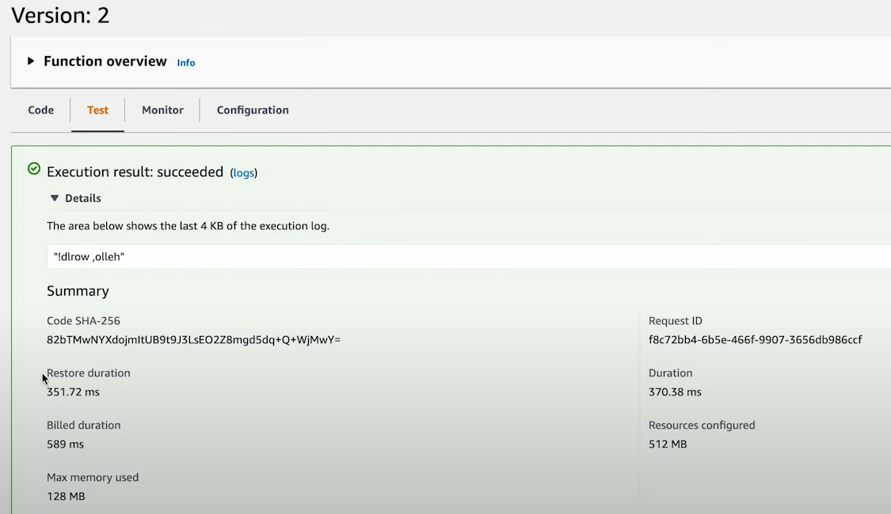

4th test (SnapStart's hot start)

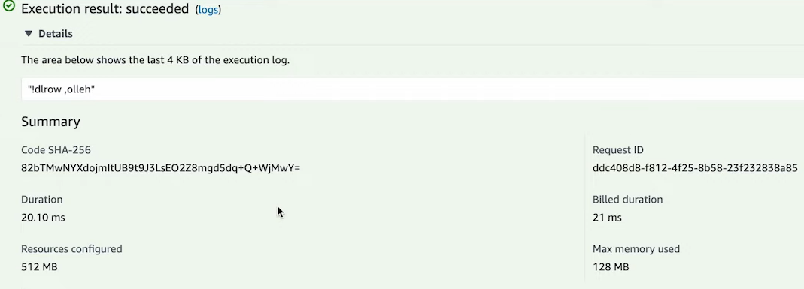

```dos
Duration: 20.10 ms
Billed durartion: 21 ms
```

#### How to deploy Java app to AWS with Lambda

##### Hello World

[Java part]

Amazon Corretto

org.apache.maven.archetypes:maven-archetype-quickstart

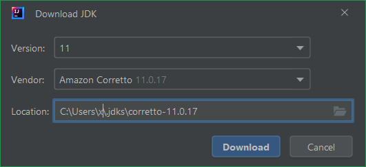


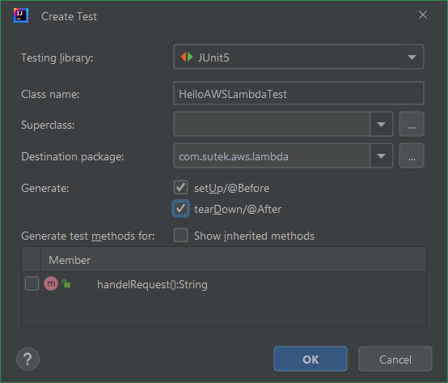

```xml
  <properties>
    <project.build.sourceEncoding>UTF-8</project.build.sourceEncoding>
    <maven.compiler.source>11</maven.compiler.source>
    <maven.compiler.target>11</maven.compiler.target>
  </properties>

  <dependencies>
    <dependency>
      <groupId>org.junit.jupiter</groupId>
      <artifactId>junit-jupiter</artifactId>
      <version>5.8.2</version>
      <scope>test</scope>
    </dependency>
  </dependencies>

  <build>
    <plugins>
      <plugin>
        <groupId>org.apache.maven.plugins</groupId>
        <artifactId>maven-shade-plugin</artifactId>
        <version>3.2.4</version>
        <configuration>
          <createDependencyReducedPom>false</createDependencyReducedPom>
        </configuration>
        <executions>
          <execution>
            <phase>package</phase>
            <goals>
              <goal>shade</goal>
            </goals>
          </execution>
        </executions>
      </plugin>
    </plugins>
  </build>
```

```java
public class HelloAWSLambda
{
    public String handelRequest()
    {
        return "Hello AWS Lambda";
    }
}
```

```dos
mvn clean package
```

`hello-lambda-1.0-SNAPSHOT.jar`

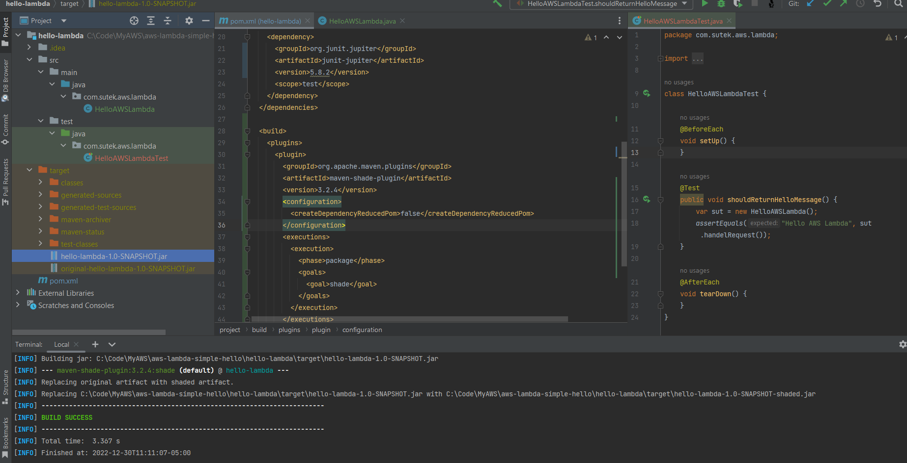

[IntelliJ tips]

If you got issues like "Unresolved plugin: 'org.apache.maven.plugins:maven-clean-plugin:2.5'", try to clean up .m2 folder.

- Close IntelliJ
- mv .m2 .m2_old
- Lanuch IntelliJ again
- CTRL+SHIFT+A -> "Reload All Maven Projects"

Also, if rebuild doesn't resolve some maven issues, try "Reload All Maven Projects"!

[AWS part]

Create function

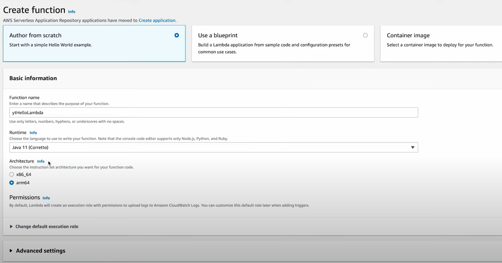

Upload .jar file

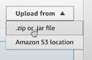

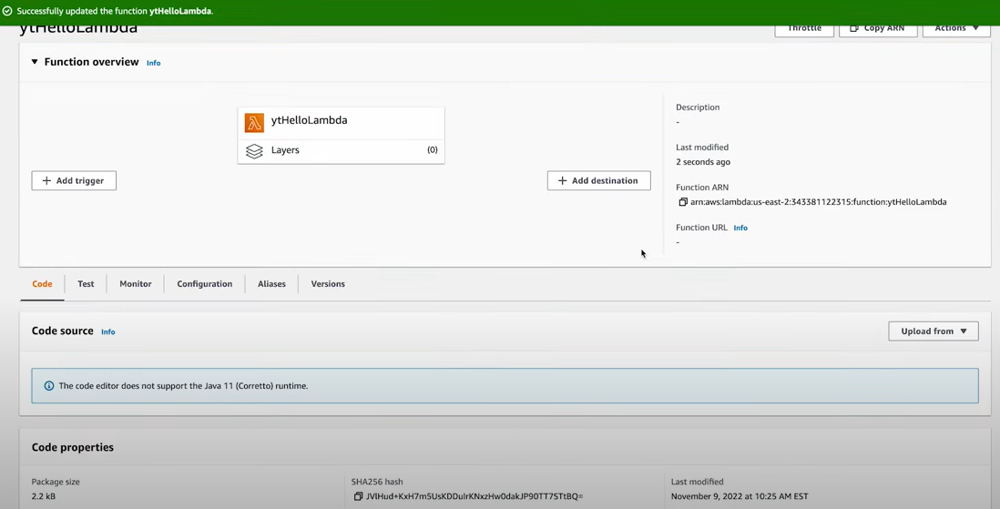

Edit runtime settings

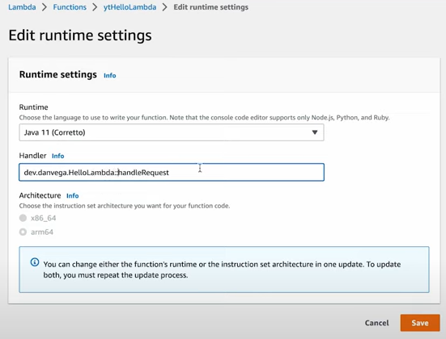

Test

In this case, just empty string

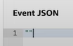

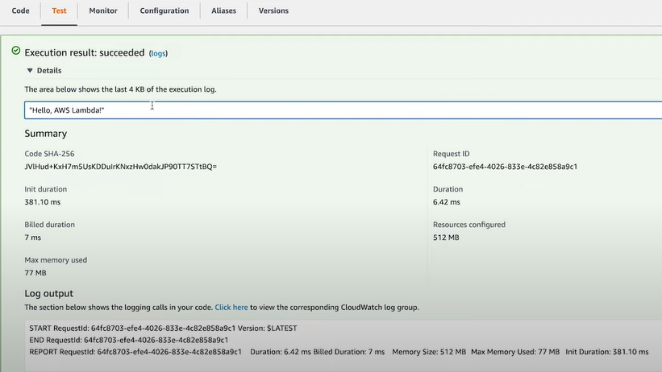

##### Hello name

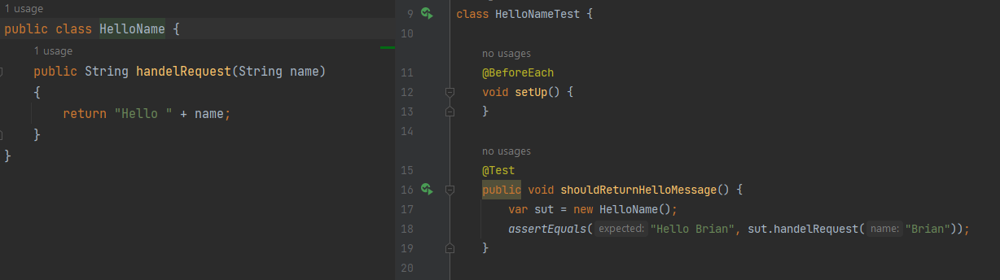

Test

In this case, just simple string


#### How to use the AWS Lambda Java Core Library

[Developer Guide]

<https://docs.aws.amazon.com/lambda/latest/dg/lambda-java.html>

Lambda provides the following libraries for Java functions:

- com.amazonaws:aws-lambda-java-core (required) – Defines handler method interfaces and the context object that the runtime passes to the handler. If you define your own input types, this is the only library that you need.
- com.amazonaws:aws-lambda-java-events – Input types for events from services that invoke Lambda functions.
- com.amazonaws:aws-lambda-java-log4j2 – An appender library for Apache Log4j 2 that you can use to add the request ID for the current invocation to your function logs.
- AWS SDK for Java 2.0 – The official AWS SDK for the Java programming language.

[Java part]

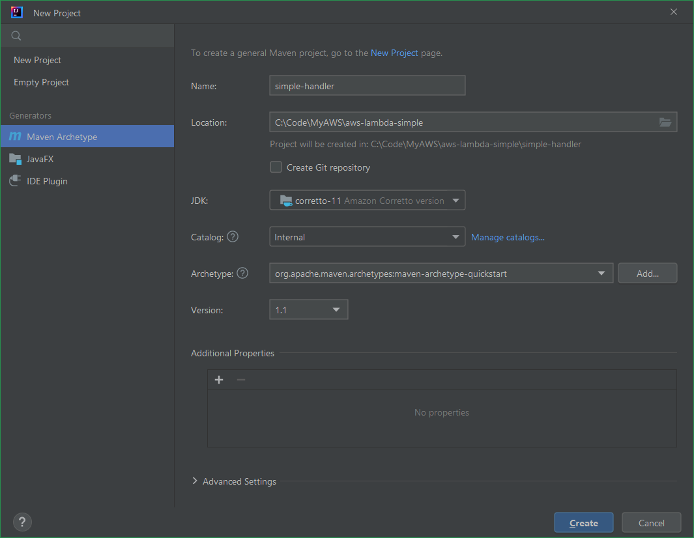

```xml
  <properties>
    <project.build.sourceEncoding>UTF-8</project.build.sourceEncoding>
    <maven.compiler.source>11</maven.compiler.source>
    <maven.compiler.target>11</maven.compiler.target>
  </properties>

  <dependencies>
    <dependency>
      <groupId>com.amazonaws</groupId>
      <artifactId>aws-lambda-java-core</artifactId>
      <version>1.2.1</version>
    </dependency>
    <dependency>
      <groupId>org.junit.jupiter</groupId>
      <artifactId>junit-jupiter</artifactId>
      <version>5.8.2</version>
      <scope>test</scope>
    </dependency>
  </dependencies>
```

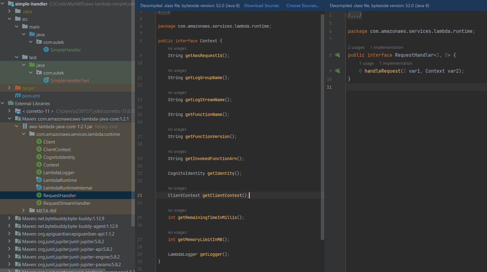

[AWS part]

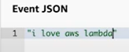

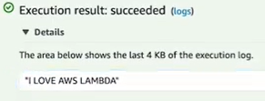

### How to deploy an React app to AWS

#### How to deploy React app to AWS ECR+EC2+ECS with docker (recommended)

- React part
  - Create React app
    Route, i18n, use hooks, promises etc.
  - Build backend APIs with Java, Node.js, python etc.

- Docker part
  - Create a Dockerfile
    Use ngix to serve the static files

- AWS part
  - AWS CLI
    - install
    - config
  - AWS ECR
    - Create a new repository (private)
    - Push command with AWS CLI
  - AWS EC2
    - Load balancer
      - Application Load Balancer
        - VPC
        - Security Group
        - Routing
  - AWS ECS
    - Task Definition
    - Add Container
      - Image (URI of the ECR repository)
      - Memory limits
      - Port mappings
      - Login configuration
    - Cluster
      - EC2 instance type
      - Networking (VPC, security group etc.)
    - Create service
      - Launch type: EC2
      - Load Balancing
  - Verify
    - EC2 -> Load Balancers -> DNS name
    - Check in browser

#### How to deploy React app to AWS EC2 (not recommended)

- React part
  - Create React app
    Route, i18n, use hooks, promises etc.
  - Build backend APIs with Java, Node.js, python etc.

- AWS part
  - AWS EC2
    - Instance type
    - Security group
      - HTTP
      - HTTPS
    - Key pair
    - Launch
      - Public IP
      - Private IP
    - Connect with SSH
      - install nodejs
      - git clone
      - npm i
      - forever start app.js

#### How to deploy React app to AWS S3 (not recommended)

- React part
  - Create React app
    Route, i18n, use hooks, promises etc.
  - Build backend APIs with Java, Node.js, python etc.
  - Generate static HTML pages with react-snapshot or react-snap.

    `"build": "react-scripts build && react-snapshot"`

    `npm build`

- AWS part
  - RDS (for DB like MySQL)
    note the endpoint & port
  - Elastic Beanstalk (to run and manage web apps)
    "Environments": Upload jar file
    "Configurations": gradle, maven, IAM
    Load balancing, auto scaling etc.
  - S3 (for hosting)
    - Create a new S3 bucket
      - ACL disabled / enabled
      - Enable / Disable public access
    - Configure the S3 bucket  
      - Enable "Static Web Hosting"
      - Permissions
        - Bucket policy
        - S3, GetObject
        - Resource ARN
  - Publish the static files
    - Copy the static files with AWS CLI
      (or drag-n-drop to AWS console UI but this is not recommended)

## Misc

### Amazon Elastic Container Service (Amazon ECS)

- How it works

Amazon ECS is a fully managed container orchestration service that makes it easy for you to deploy, manage, and scale containerized applications.

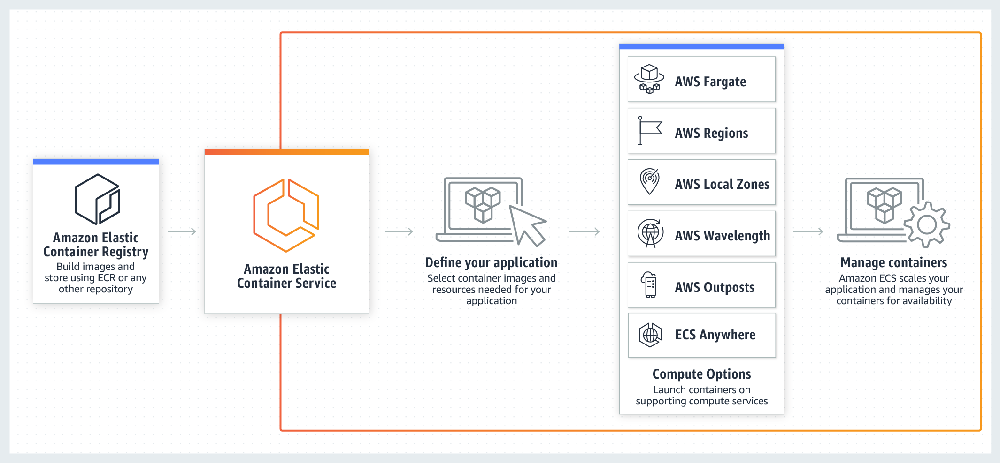

- Use cases

  - Deploy in a hybrid environment

  Build container-based applications on-premises or in the cloud with Amazon ECS Anywhere and enjoy consistent tooling, management, workload scheduling, and monitoring across environments.

  - Support batch processing

  Plan, schedule, and execute batch computing workloads across the full range of AWS services, including Amazon Elastic Compute Cloud (EC2), Fargate, and Amazon EC2 Spot Instances.

  - Scale web applications

  Automatically scale and run web applications in multiple Availability Zones with the performance, scale, reliability, and availability of AWS.

### Amazon Elastic Container Registry (Amazon ECR)

- How it works

Amazon ECR is a fully managed container registry offering high-performance hosting, so you can reliably deploy application images and artifacts anywhere.

- Use cases

  - Manage software vulnerabilities

    Meet your image compliance security requirements using the tightly integrated Amazon Inspector vulnerability management service to automate vulnerability assessment scanning and remediation ticket routing.

  - Streamline your deployment workloads

    Publish containerized applications with a single command and easily integrate your self-managed environments.

  - Manage image lifecycle policies

    Automatically preserve the most recent images and archive ones you don’t need. Use rules and tagging to access images quickly.

### AWS Elastic Beanstalk

- Why AWS Elastic Beanstalk?

Elastic Beanstalk is a service for deploying and scaling web applications and services. Upload your code and Elastic Beanstalk automatically handles the deployment—from capacity provisioning, load balancing, and auto scaling to application health monitoring.

- Use cases

  - Quickly launch web applications

  Deploy scalable web applications in minutes without the complexity of provisioning and managing underlying infrastructure.

  - Create mobile API backends for your applications

  Use your favorite programming language to build mobile API backends, and Elastic Beanstalk will manage patches and updates.

  - Replatform critical business applications

  Migrate stateful applications off legacy infrastructure to Elastic Beanstalk and connect securely to your private network.

### Amazon Rekognition Video

You can use Amazon Rekognition Video to detect and recognize faces or detect objects in streaming video. Amazon Rekognition Video uses Amazon Kinesis Video Streams to receive and process a video stream. You create a stream processor with parameters that show what you want the stream processor to detect from the video stream. Rekognition sends label detection results from streaming video events as Amazon SNS and Amazon S3 notifications. Rekognition outputs face search results to a Kinesis data stream.

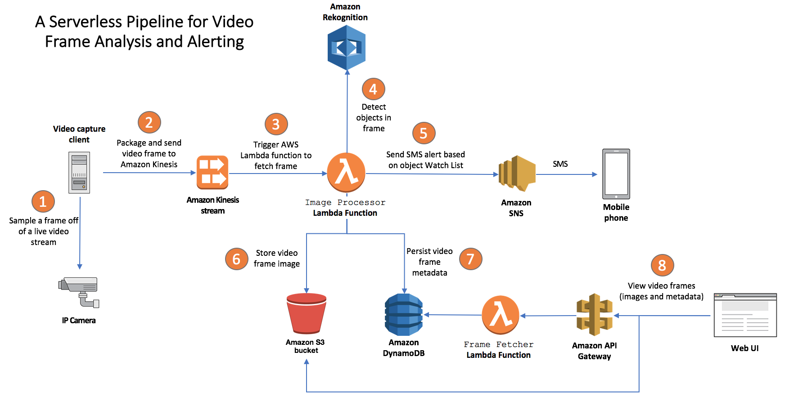

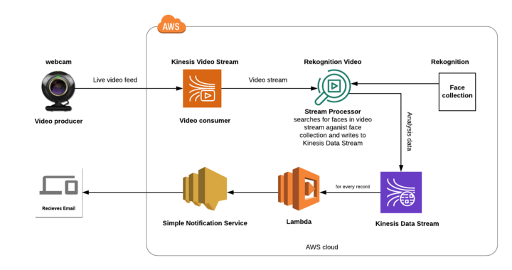
