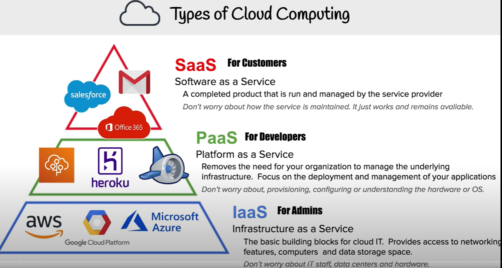
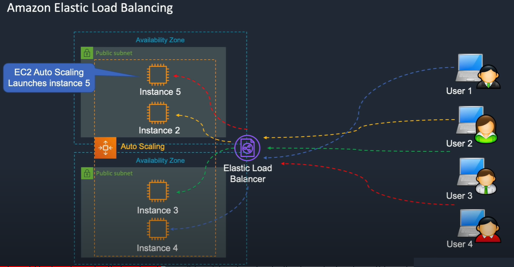

# MyAWS

My AWS

## AWS Certified Cloud Practitioner

## AWS intro

## AWS questions

### AWS cloud formation

What are the steps involved in a CloudFormation Solution?

- Create or use an existing CloudFormation template using JSON or YAML format.
- Save the code in an S3 bucket, which serves as a repository for the code.
- Use AWS CloudFormation to call the bucket and create a stack on your template.
- CloudFormation reads the file and understands the services that are called, their order, the relationship between the services, and provisions the services one after the other.

AWS CloudFormation provides users with a simple way to create and manage a collection of Amazon Web Services (AWS) resources by provisioning and updating them in a predictable way. AWS CloudFormation enables you to manage your complete infrastructure or AWS resources in a text file.

AWS CloudFormation enables you to manage your complete infrastructure or AWS resources in a text file, or template. A collection of AWS resources is called a stack. AWS resources can be created or updated by using a stack.

All the resources you require in an application can be deployed easily using templates. Also, you can reuse your templates to replicate your infrastructure in multiple environments. To make templates reusable, use the parameters, mappings and conditions sections in the template so that you can customize your stacks when you create them.

An AWS CloudFormation template is a formatted text file in JSON or YAML language that describes your AWS infrastructure. To create, view and modify templates, you can use AWS CloudFormation Designer or any text editor tool. An AWS CloudFormation template consists of nine main objects:

1. Format version: Format version defines the capability of a template.

2. Description: Any comments about your template can be specified in the description.

3. Metadata: Metadata can be used in the template to provide further information using JSON or YAML objects.

4. Parameters: Templates can be customized using parameters. Each time you create or update your stack, parameters help you give your template custom values at runtime.

5. Mappings: Mapping enables you to map keys to a corresponding named value that you specify in a conditional parameter. Also, you can retrieve values in a map by using the “Fn:: FindInMap” intrinsic function.

6. Conditions: In a template, conditions define whether certain resources are created or when resource properties are assigned to a value during stack creation or updating. Conditions can be used when you want to reuse the templates by creating resources in different contexts. You can use intrinsic functions to define conditions.

In a template, during stack creation, all the conditions in your template are evaluated. Any resources that are associated with a true condition are created, and the invalid conditions are ignored automatically.

7. Transform: Transform builds a simple declarative language for AWS CloudFormation and enables reuse of template components. Here, you can declare a single transform or multiple transforms within a template.

8. Resources: Using this section, you can declare the AWS resource that you want to create and specify in the stack, such as an Amazon S3 bucket or AWS Lambda.

9. Output: In a template, the output section describes the output values that you can import into other stacks or the values that are returned when you view your own stack properties. For example, for an S3 bucket name, you can declare an output and use the “Description-stacks” command from the AWS CloudFormation service to make the bucket name easier to find.

### AWS CloudFormation vs AWS Elastic Beanstalk

AWS CloudFormation helps you provision and describe all of the infrastructure resources that are present in your cloud environment. On the other hand, AWS Elastic Beanstalk provides an environment that makes it easy to deploy and run applications in the cloud.

AWS CloudFormation supports the infrastructure needs of various types of applications, like legacy applications and existing enterprise applications. On the other hand, AWS Elastic Beanstalk is combined with the developer tools to help you manage the lifecycle of your applications.

### What happens when one of the resources in a stack cannot be created successfully by Cloud Formation?

If the resource in the stack cannot be created, then the CloudFormation automatically rolls back and terminates all the resources that were created in the CloudFormation template. This is a handy feature when you accidentally exceed your limit of Elastic IP addresses or don’t have access to an EC2 AMI.

### How to log into the cloud environment other than console?

- Putty
- AWS CLI for Linux
- AWS CLI for Windows
- AWS CLI for Windows CMD
- AWS SDK
- Eclipse

### What AWS services can be used to create a centralized logging solution?

The essential services that you can use are Amazon CloudWatch Logs, store them in Amazon S3, and then use Amazon Elastic Search to visualize them.

You can use Amazon Kinesis Firehose to move the data from Amazon S3 to Amazon ElasticSearch.

### Name some of the AWS services that are not region-specific

AWS services that are not region-specific are:

- IAM
- Route 53
- Web Application Firewall
- CloudFront

### Stopping vs Terminating an EC2 instance

While you may think that both stopping and terminating are the same, there is a difference. When you stop an EC2 instance, it performs a normal shutdown on the instance and moves to a stopped state.

When you terminate the instance, it is transferred to a stopped state, and the EBS volumes attached to it are deleted and can never be recovered.

### How to configure CloudWatch to recover an EC2 instance?

- Create an Alarm using Amazon CloudWatch
- In the Alarm, go to Define Alarm -> Actions tab
- Choose Recover this instance option

### How to recover/login to an EC2 instance if the key has been lost?

- Verify that the EC2Config service is running
- Detach the root volume for the instance
- Attach the volume to a temporary instance
- Modify the configuration file
- Restart the original instance

### Differences between AWS S3 and EBS

Amazon Elastic Block Store (Amazon EBS) provides block level storage volumes for use with EC2 instances. EBS volumes behave like raw, unformatted block devices. You can mount these volumes as devices on your instances.

### How to monitor Amazon VPC?

- CloudWatch and CloudWatch logs
- VPC Flow Logs

### How many Subnets can you have per VPC?

We can have up to 200 Subnets per Amazon Virtual Private Cloud (VPC).

### How can you add an existing instance to a new Auto Scaling group?

- Open EC2 console
- Select your instance under Instances
- Choose Actions -> Instance Settings -> Attach to Auto Scaling Group
- Select a new Auto Scaling group
- Attach this group to the Instance
- Edit the Instance if needed
- Once done, you can successfully add the instance to a new Auto Scaling group

### RTO and RPO in AWS?

RTO or Recovery Time Objective is the maximum time your business or organization is willing to wait for a recovery to complete in the wake of an outage.

RPO or Recovery Point Objective is the maximum amount of data loss your company is willing to accept as measured in time.

### Connection Draining

Connection Draining is an AWS service that allows us to serve current requests on the servers that are either being decommissioned or updated.

By enabling this Connection Draining, we let the Load Balancer make an outgoing instance finish its existing requests for a set length of time before sending it any new requests. A departing instance will immediately go off if Connection Draining is not enabled, and all pending requests will fail.

### How can you use AWS WAF in monitoring your AWS applications?

AWS WAF or AWS Web Application Firewall protects your web applications from web exploitations. It helps you control the traffic flow to your applications.

With WAF, you can also create custom rules that block common attack patterns. It can be used for three cases: allow all requests, prevent all requests, and count all requests for a new policy.

### IAM role vs IAM user

The two key differences between the IAM role and IAM user are:

- An IAM role is an IAM entity that defines a set of permissions for making AWS service requests, while an IAM user has permanent long-term credentials and is used to interact with the AWS services directly.

- In the IAM role, trusted entities, like IAM users, applications, or an AWS service, assume roles whereas the IAM user has full access to all the AWS IAM functionalities.
